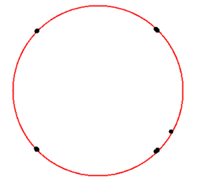

# SignalCodeConstructions
Сигнально-кодовые конструкции и их распознавание 
## Введение
При передаче цифровых данных по каналу связи всегда существует вероятность того, что принятые данные будут содержать ошибки. Снизить эту вероятность можно путем использования избыточного или помехоустойчивого кодирования. Интенсивно исследуются возможности цифровых телекоммуникационных систем, в которых для передачи информации используются ансамбли многопозиционных сигналов в сочетании с помехоустойчивыми кодами, причем, процедуры модуляции/кодирования (демодуляции/декодирования) осуществляются совместно. Также изучаются методы согласования модуляции и кодирования, позволяющие формировать такие сигнально-кодовые конструкции, которые обеспечивали бы высокими две важнейшие характеристики системы радиосвязи, такие как - энергетическая и частотная эффективности, характеризующие, соответственно, энергетические затраты и полосу занимаемых частот, необходимых для передачи сообщений.  
При поступлении сигнала на приемник необходимо знать информацию о модуляции, она имеет основополагающее значение для правильной демодуляции. Распознавание модуляции – это процесс определения типа модуляции принимаемого сигнала. Данный процесс широко используется в мониторинге радиосигналов, а также для установления связи между приемником и передатчиком. Разработка методов, обладающих высокой точностью распознавания при низком отношении сигнал/шум (ОСШ) является актуальной задачей теории и практики электросвязи.
## Постановка задачи
Данная работа направлена на знакомство с сигнально-кодовыми конструкциями (СКК), их назначением и классификацией, рассмотрение методов распознавания фазовой модуляции разной кратности, моделирование и анализ результатов фазовой модуляции-демодуляции сигнала, а также на моделирование методов распознавания фазовой модуляции и сравнение их на устойчивость к помехам.
## Цели:
1.	Изучить принципы построения сигнально-кодовых конструкций, рассмотреть их классификацию, а также назначение;
2.	Рассмотреть методы распознавания фазовой модуляции разной кратности;
3.	Написать приложение, моделирующее фазовую модуляцию-демодуляцию сигнала, а также проанализировать результаты, полученные при изменение таких параметров как шум, кратность модуляции;
4.	Написать приложение, моделирующее методы распознавания фазовой модуляции с разной кратностью (ФМ-2, ФМ-4, ФМ-8), а также проанализировать их на устойчивость к шумам;
## Теоретическая часть
**Сигнально-кодовая конструкция** (СКК) - сигнальная последовательность, построенные на базе помехоустойчивых кодов и многопозиционных сигналов, образующаяся на выходе последовательно-соединенных кодера и модулятора. То есть СКК представляет собой пару – метод модуляции и код с исправлением ошибок (помехоустойчивый).
## Классификация сигнально-кодовых конструкций
По типу помехоустойчивых кодов все СКК можно разделить на два больших класса: СКК на основе блочных кодов, СКК на основе непрерывных кодов. По типу ансамблей сигналов СКК делятся на конструкции с одномерными, двумерными и многомерными сигналами. Многомерные сигналы состоят из более простых (одномерных, двумерных) сигналов. Методы сопоставления модуляции и кодирования условно можно разделить на две группы: сопоставление по коду Грея и сопоставление, основанное на разделении ансамбля на вложенные подансамбли.
## Распознавание фазовой модуляции разной кратности
Распознавание сигнально-кодовых конструкций происходит в два этапа. На первом этапе распознаем метод модуляции сигнала, на втором этапе распознаем тип помехоустойчивого кода.
### Методы распознавания радиосигналов с фазовой модуляцией
Задачи MR делятся на два основных класса: согласованные (cooperative) и несогласованные (non-cooperative). В первом случае между передающей и приемной стороной есть предварительные договоренности, например, что сигнал следует передавать на известной приемнику несущей, или что длительность передаваемого символа должна быть заранее оговоренной длины, или что сигнал модулирован непременно одним из нескольких заранее известных видов. Несогласованность означает, что таких договоренностей нет: на приемной стороне нет никакой информации, кроме массива искаженных шумами отсчетов. 
Попыток распознавания вида модуляции с учетом всей реальной неопределенности практически не предпринималось. Во множестве работ (а их число уже исчисляется сотнями, и новые появляются практически ежемесячно) обязательно что-то полагается известным: либо некоторые параметры сигнала, либо вид шума, либо ОСШ, либо комбинации перечисленного.
1. Первый метод распознавания вида модуляции относится к классу: согласованные. Сводится он к определению числа позиций точек сигнального созвездия. При этом вероятность правильного распознавания вида модуляции определяется точностью измерения номинала несущей и тактовой частот, зависит от отношения сигнал/шум (ОСШ) в пункте приема, наличия и интенсивности мультипликативных искажений и ряда других факторов. Возможность использования сигнального созвездия для распознавания вида модуляции ограничивается необходимостью точного знания частоты и начальной фазы несущего колебания. При этом отношение сигнал/шум должно быть не ниже 5…20 дБ в зависимости от вида модуляции. Невыполнение данных ограничений практически исключает возможность распознавания сигналов по виду модуляции. Это обуславливает необходимость поиска новых признаков распознавания, измерение которых не требует соблюдения таких жестко ограниченных условий.
2. Второй метод распознавания вида модуляции относится к классу: несогласованные. В данном метода основным в качестве основного отличительного признака берется коэффициент эксцесса. Коэффициент эксцесса нормального распределения равен 0; распределение более островершинное по сравнению с нормальным имеют положительный коэффициент эксцесса; плосковершинные распределения – отрицательный коэффициент эксцесса. 
Основным отличительным признаком сигналов ФМ является постоянная огибающая, закон распределения которой описывается дельта-функцией. распределение огибающей сигналов ФМ является одномодальным, но в зависимости от кратности модуляции распределение будет либо более островершинным, либо более плосковершинным. Следовательно такое распределение можно считать отличительной характеристикой для сигналов. 
Параметром случайного процесса, характеризующим островершинность или плосковершинность его распределения, является коэффициент эксцесса. Коэффициент нормального распределения равен 0, а распределения более островершинные по сравнению с нормальным или менее островершинные имеют коэффициент эксцесса положительный или отрицательный соответственно. Таким образом, значение коэффициента эксцесса распределения огибающей может быть использовано для различения сигналов ФМ разной кратности.
## Практическая часть
### **Фазовая модуляция и демодуляция сигнала.** 

В ходе практической работы было написано приложение, реализующее такие операции над сигналом, как фазовая модуляция и демодуляция. Фазовая манипуляция – один из видов фазовой модуляции, при которой фаза несущего колебания меняется скачкообразно в зависимости от информационного сообщения. 
Имеется сигнал несущей частоты: 
Sn(t) = Acos(2π * fc * t + φ0), 
где A – амплитуда сигнала; fc – несущая частота; φ0 – начальная фаза. 

Модулирующий сигнал выглядит следующим образом: 
Sm(t) = Acos(φ), 
где φ = (2 * π * (k – 1)) / M + φ0, 1 ≤ k ≤ M; M – кратность модуляции. 

Сигнал с фазовой модуляцией: 
S(t) = Acos(2π * fc * t + φ * Sm(t)). 

**Сначала был рассмотрен случай, когда модулированный сигнал незашумлен.** 
Начнем с самого простого вида фазовой модуляции – фазовая модуляция с кратностью два (ФМ-2), когда имеется всего два значения фазы – 0 ̊ и 180 ̊. ФМ-2 сигнал передает один бит на символ. Каждое изменениемодулирующего сигнала приводит к скачкообразному изменению фазы несущей частоты на 180 ̊. То есть модулированный сигнал будет выглядеть как сигнал несущей частоты, но с измененной фазой в том месте, где у модулирующего сигнала произошел скачок (смена фазы). Сигнальное созвездие при кратности модуляции два, будет из себя представлять окружность радиуса R, с двумя точками, координаты которых (-R, 0) и (R, 0). 
Далее необходимо демодулировать сигнал. Для этого нужно умножить модулированный сигнал на сигнал несущей частоты: 
Sd(t) = Sm(t) * Sn(t).
Затем применить алгоритм сверточной фильтрации во временной области. В скользящем по массиву произведений прямоугольном окне заданной ширины L производится вычисление среднего значения отсчетов, которые охватывает окно. Результаты первого эксперимента можно наблюдать ниже.
### Результаты работы программы

Рис.1. Модулирующий сигнал.

Рис.2. Модулированный сигнал.

Рис.3. Сигнальное созвездие.

Рис.4. Демодулированный сигнал.

**Второй эксперимент был проведен с зашумленным модулированным сигналом**, кратность фазовой модуляции не менялся. После модуляции сигнала, на него накладывается белый шум. Результат демодуляции можно посмотреть ниже. Как можно заметить, модуляция с кратностью два (ФМ-2) достаточно помехоустойчива.

Рис.5. Модулирующий сигнал.

Рис.6. Модулированный сигнал.

Рис.7. Сигнальное созвездие.

Рис.8. Демодулированный сигнал.

### **Методы распознавания фазовой модуляции сигнала (ФМ-2, ФМ-4, ФМ-8)** 

В ходе практической работы были реализованы методы распознавания фазовой модуляции разной кратности. 
Первый метод распознавания сводится к определению числа позиций точек сигнального созвездия. Для реализации данного метода важным является точное знание частоты и начальной фазы несущего колебания, для предварительной и последующей синхронизации радиосигнала. 

На приемную сторону поступает модулированный сигнал:

Рис.9. Модулированный сигнал.

Генератор сигналов генерирует несущий сигнал, начальная фаза и частота которого равны начальной фазе и частоте модулированного сигнала соответственно.

Рис.10. Несущий сигнал.

**Первый эксперимент проводился с интенсивностью шума равной 0%.** В каждый момент времени рассчитывалась разность фаз и если она была больше нуля, то, следовательно, в этот момент произошел скачок фазы и эту разность необходимо было запомнить, так как ее значение было равно одной из позиций на сигнальном созвездии. Как только разность фаз не равна нулю, в этот момент времени необходимо было сделать синхронизацию несущего сигнала, для дальнейшего расчета разности фаз. Результаты работы данного метода можно посмотреть ниже.

Рис.11. Восстановленное сигнальное созвездие (ФМ2).

Рис.12. Восстановленное сигнальное созвездие (ФМ4).

Рис.13. Восстановленное сигнальное созвездие (ФМ8).

**Второй эксперимент проводился при разных отношениях ОСШ.** В каждый момент рассчитывалась разность фаз и если она была больше некоторого заранее заданного порога, то, следовательно, в этот момент произошел скачок фазы и эту разность необходимо было запомнить, так как ее значение было равно одной из позиций на сигнальном созвездие Результаты работы метода можно посмотреть ниже.

Рис.14. Восстановленное сигнальное созвездие при ФМ2 с отношением ОСШ
40 дБ.

Рис.15. Восстановленное сигнальное созвездие при ФМ2 с отношением ОСШ
25 дБ.

Рис.16. Восстановленное сигнальное созвездие при ФМ2 с отношением ОСШ
20 дБ

Рис.17. Восстановленное сигнальное созвездие при ФМ2 с отношением ОСШ
17 дБ

Рис.18. Восстановленное сигнальное созвездие при ФМ2 с отношением ОСШ
14 дБ.

Рис.19. Восстановленное сигнальное созвездие при ФМ4 с отношением ОСШ
40 дБ.

Рис.20. Восстановленное сигнальное созвездие при ФМ4 с отношением ОСШ
25 дБ.

Рис.21. Восстановленное сигнальное созвездие при ФМ4 с отношением ОСШ
19 дБ.

Рис.22. Восстановленное сигнальное созвездие при ФМ4 с отношением ОСШ
16 дБ.

Рис.23. Восстановленное сигнальное созвездие при ФМ8 с отношением ОСШ
40 дБ.

Рис.24. Восстановленное сигнальное созвездие при ФМ8 с отношением ОСШ
26 дБ.

Рис.25. Восстановленное сигнальное созвездие при ФМ8 с отношением ОСШ
17 дБ.

Второй метод распознавания относится к классу: несогласованные методы. Для реализации данного метода нет необходимости знать заранее априорную информацию о сигнале (частоту, фазу), единственное, что нужно знать для этого метода это отношение сигнал/шум. Основным отличительным признаком ФМ2, ФМ4, ФМ8 сигналов является его постоянная огибающая. Параметром случайного процесса, характеризующим его островершинность или плосковершинность, является коэффициент эксцесса.

Рис.26. Спектр ФМ2 сигнала.

Рис.27. Спектр ФМ4 сигнала.

Рис.28. Спектр ФМ8 сигнала.

Правило различения сформулировано на основе анализа зависимости эксцесса огибающей для различных видов модуляции (ФМ2, ФМ4, ФМ8), от ОСШ. Графики зависимости, представленные на рис.30, получены на основе усреднения результатов 100 независимых испытаний для каждой модуляции и значения ОСШ. Видно, что зависимость коэффициента эксцесса от ОСШ определяется видом модуляции.

Рис.29. График зависимости коэффициента эксцесса от отношения
сигнал/шум.

Предложенный метод позволяет решать задачу различения сигналов ФМ с разной кратностью при отсутствии частотной и тактовой синхронизации при
ОСШ не менее 9 дБ, что превосходит первый метод.

## Заключение
1.	Рассмотрены сигнально-кодовые конструкции, их назначение и классификация;
2.	Рассмотрены методы распознавания фазовой модуляции разной кратности;
3.	Написано приложение, моделирующее фазовую модуляцию и демодуляцию сигнала, а также сделан анализ на основе результатов, полученных при изменении таких параметров, как шум, кратность модуляции: по результатам экспериментов можно заметить, что успех демодуляции зависит от кратности модуляции, интенсивности шумов;
4.	Написано приложение, моделирующее методы распознавания фазовой модуляции с разной кратностью (ФМ-2, ФМ-4, ФМ-8), а также проанализирована их устойчивость к шумам: метод распознавания фазовой модуляции, сводящийся к расчету коэффициента эксцесса позволяет решать задачу различения сигналов ФМ с разной кратностью при ОСШ не менее 9 дБ, что превосходит метод, сводящийся к определению числа позиций точек на сигнальном созвездие;
## Литература
1.	А.И. Королев. Сигнально-кодовые конструкции в телекоммуникационных системах. Минск: Издательство БГУИР, 2009.
2.	К.К. Васильев, В.А. Глушков, А.В. Дормидонтов, А.Г. Нестеренко. Теория электрической связи. М.:Издательство УлГТУ, 2008.
3.	А.М. Голиков. Модуляция, кодирование и моделирование в телекоммуникационных системах. М.:Минск, 2016.
4.	А.Г.Зюко, Д.Д.Кловский, В.И.Коржик, М.В.Назаров. Теория электрической связи. М.:Издательство «Радио и связь», 1999.
5.	А.В. Давыдов, А.А. Мальцев. Введение в теорию помехоустойчивого кодирования. Нижний Новгород: Нижегородский госуниверситет, 2014.
6.	Е. И. Балунин, А. Ю. Баринов, С. В. Дианов, В. С. Дмитриевский, И. Е. Калмычков. Обнаружение и распознавание сигнально-кодовых конструкций. Москва: Издательство «Радиотехника», 2013.
7.	В. Леонидов. Модуляция и демодуляция цифровых сигналов- конспект лекций. (https://leonidov.su/ru/modulation-and-demodulation-lection-notes/)
